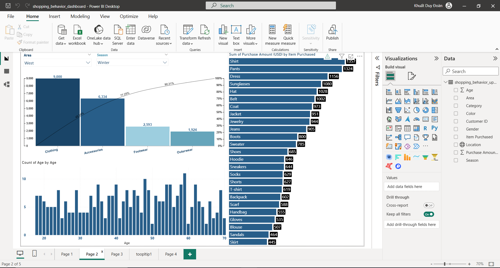
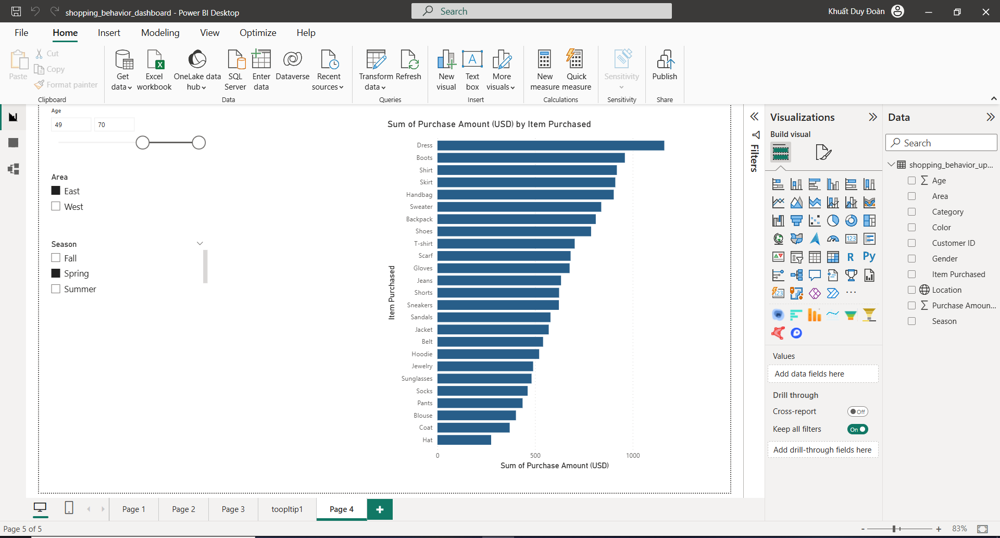
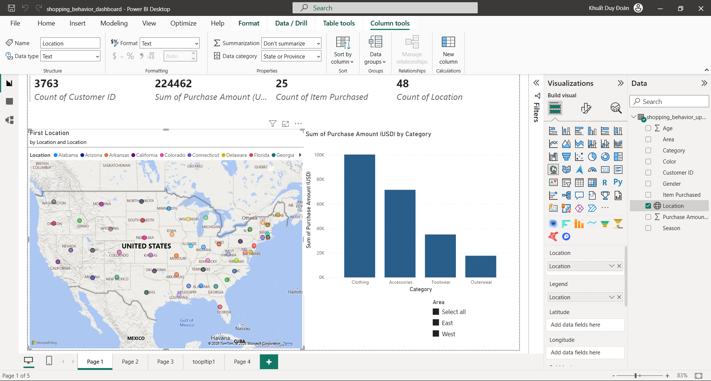

# Shopping Behavior Analysis

## Overview
This project analyzes customer shopping behavior in the United States using Python and Power BI to identify purchasing trends, customer segments, and regional sales performance.

## Tools Used
- Python
- Power BI
- Pandas
- Matplotlib
- Seaborn

## Objectives
- Analyze customer purchasing behavior
- Compare shopping trends across regions
- Explore customer behavior by age and season
- Support business decision-making through data visualization

## Data Processing
- Cleaned and transformed raw customer data
- Reduced unnecessary columns
- Created a new feature: Area (East vs West)
- Prepared data for exploratory data analysis and dashboard visualization

## Key Insights
- Eastern states generated the highest sales performance
- Purchasing behavior differs significantly across age groups
- Seasonal trends strongly influence product demand
- Male customers contributed a larger portion of purchases

## Dashboard Preview

### Area Overview

### Area Purchase Analysis

### Customer Analysis

## Files Included
- `shopping_behavior_analysis.ipynb` → exploratory data analysis
- `feature_engineering.ipynb` → data cleaning and feature engineering
- `shopping_behavior_dashboard.pbix` → Power BI dashboard
- `project_presentation.pdf` → project presentation
- `clean_customer_area_data.csv` → cleaned dataset
